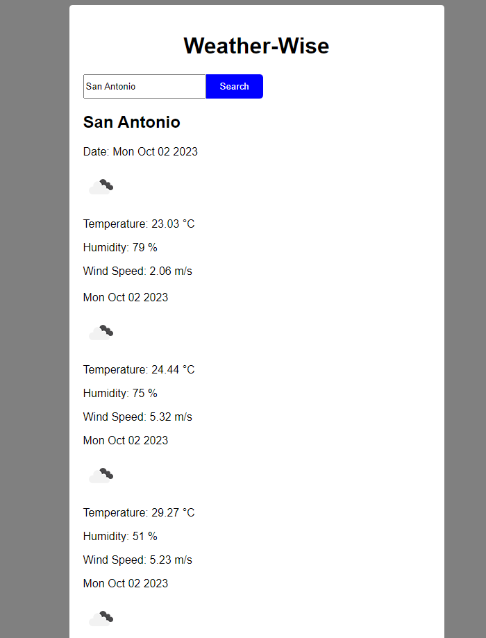

# Weather-Wise

## Project Description
Weather-Wise is a simple weather dashboard application that allows users to search for the current weather and 5-day weather forecast for a specific city. It provides information such as temperature, humidity, wind speed, and weather conditions.

## Table of Contents
- Installation
- Usage
- Credits
- Features

## Installation
To run the Weather-Wise application, follow these steps:

- Clone the repository to your local machine.
- Open the project directory.
- Open the index.html file in your web browser.

## Usage
- Enter the name of the city you want to check the weather for in the input field.
- Click the "Search" button or press Enter.
- The current weather information, including temperature, humidity, wind speed, and weather conditions, will be displayed.
- Scroll down to view the 5-day weather forecast, which includes date, weather icons, temperature, humidity, and wind speed.
- Visual step by step guide: 

## Credits

- w3 Schools
- Stack Overflow
- Linux Hint
- Reddit

## Features
- Current weather display for the entered city.
- 5-day weather forecast with detailed information.
- User-friendly and responsive design.
- Use of external libraries for date handling and DOM manipulation.
- Error handling for network and API-related issues.
